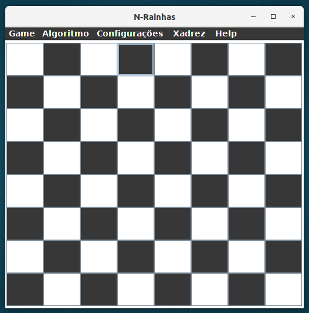
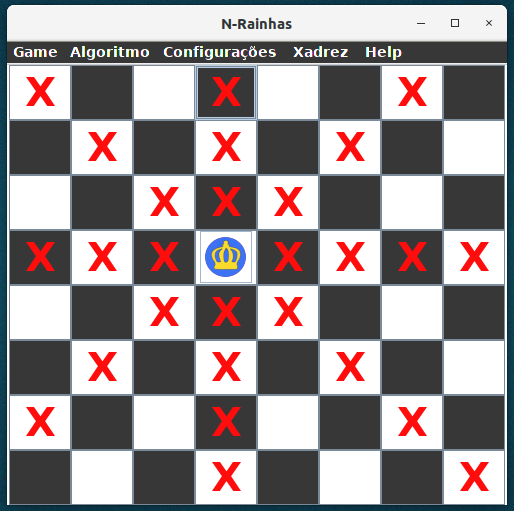
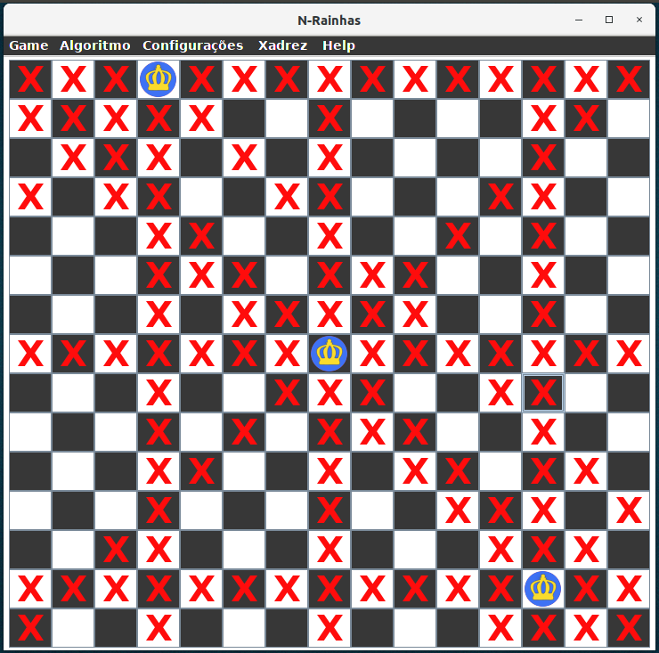

# N Rainhas

## Exemplo do Problema das N Rainhas.

O problema das oito rainhas é o problema de dispor oito rainhas em um tabuleiro de xadrez de dimensão 8x8, de forma que nenhuma delas seja atacada por outra. Seres humanos com lógica resolvem rapidamente, mas quando o número de Rainhas aumenta, e consequentemente a dimensão do tabuleiro, é possivel resolver com a mesmo pensamento anterior resolvido com o de 8? O desafio é desenvolver um algoritmo que disponha **N Rainhas** em um tabuleiro **NxN**. Uma técnica comumente usada é o [backtracking](https://pt.wikipedia.org/wiki/Backtracking), que realiza geralmente uma busca em profundiade até encontrar todas as posições possíveis.  De cara, esse método pode ser no pior caso muito custoso com 8 rainhas, com 1000 rainhas, tem solução computacional viável?

## Exemplo Criado

### Tabuleiro 8x8

### Tabuleiro com 1 Rainhas e marcada todas as possibilidade de ataque

### Tabuleiro 15x15 

